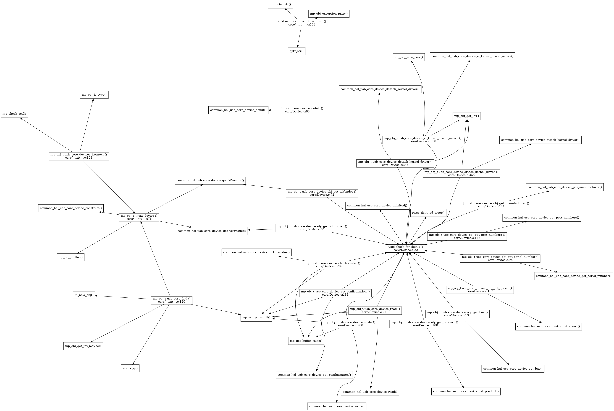

<!-- SPDX-License-Identifier: MIT -->
<!-- SPDX-FileCopyrightText: Copyright 2025 Sam Blenny -->
# Control flow visualizations with cflow

This is some stuff for visualizing the control flow of how functions call each
other in the CircuitPython USB implementation.

The examples below have terminal commands for Debian to use the `cflow` code
analysis tool to generate `graphviz` (.dot) graph files, turn them into PNG
images, and view them with the `mirage` image viewer. For `mirage` to work, you
need to run the last command in a terminal in X (vnc or physical display will
work, but not ssh).


## shared-bindings/usb/*

This example builds a directed graph of which functions call other functions
within the CircuitPython s`hared-bindings/usb/*` code. The `grep -v ...` stuff
is removing some macros that would clutter up the graph without adding much
benefit. The `sed '2i ...'` stuff is inserting a line with additional
`graphviz` attributes to improve the layout of the graph spec file created by
`cflow`. The `sfdp` command is part of `graphviz`, and it's designed to lay out
complex graphs.

```
cd ~/adafruit/circuitpython/shared-bindings/usb
cflow -i _ --all --omit-arguments -f dot {.,core,util}/{*.c,*.h} \
    | sed '2i overlap=false; K=0.4; repulsiveforce=0.8; smoothing="power_dist"' \
    | grep -v 'MP_' > ~/cflow.dot
sfdp -Tpng ~/cflow.dot > ~/cflow.png && mirage ~/cflow.png
```




## shared-module/usb/*

```
cd circuitpython/shared-module/usb
cflow -i _ --all --omit-arguments -f dot {.,core}/{*.c,*.h} util/*.c \
  | sed '2i overlap=false; K=0.9; repulsiveforce=0.8; splines=true;' \
  | grep -v 'MP_' > ~/cflow.dot
sfdp -Tpng ~/cflow.dot > ~/cflow.png && mirage ~/cflow.png
```


## supervisor/shared/usb.c

For this one, I'm using `--preprocess='arm-none-eabi-gcc -E'` and a bunch of
`-D ...` defines and `-I ...` include paths to run the preprocessor
approximately like a make `BOARD=adafruit_fruit_jam` command.

```
cd circuitpython/supervisor
cflow \
  -D CIRCUITPY_USB_CDC \
  -D CIRCUITPY_USB_DEVICE \
  -D CIRCUITPY_USB_HOST \
  -D DISABLE_FILESYSTEM \
  -I . \
  -I lib/tinyusb/src \
  -I ports/raspberrypi/ \
  -I ports/raspberrypi/boards/adafruit_fruit_jam \
  -I ports/raspberrypi/build-adafruit_fruit_jam \
  -I ports/raspberrypi/sdk_config \
  -I ports/raspberrypi/sdk/src/common/pico_base_headers/include \
  -I ports/raspberrypi/sdk/src/common/pico_sync/include \
  -I ports/raspberrypi/sdk/src/common/pico_time/include \
  -I ports/raspberrypi/sdk/src/host/pico_stdio/include \
  -I ports/raspberrypi/sdk/src/rp2_common/cmsis/ \
  -I ports/raspberrypi/sdk/src/rp2_common/hardware_base/include \
  -I ports/raspberrypi/sdk/src/rp2_common/hardware_sync_spin_lock/include \
  -I ports/raspberrypi/sdk/src/rp2_common/hardware_sync/include \
  -I ports/raspberrypi/sdk/src/rp2_common/hardware_timer/include \
  -I ports/raspberrypi/sdk/src/rp2_common/pico_platform_compiler/include \
  -I ports/raspberrypi/sdk/src/rp2_common/pico_platform_panic/include \
  -I ports/raspberrypi/sdk/src/rp2_common/pico_platform_sections/include \
  -I ports/raspberrypi/sdk/src/rp2_common/pico_stdio_usb/include \
  -I ports/raspberrypi/sdk/src/rp2350/hardware_regs/include \
  -I ports/raspberrypi/sdk/src/rp2350/hardware_structs/include \
  -I ports/raspberrypi/sdk/src/rp2350/pico_platform/include \
  -i _ \
  --preprocess='arm-none-eabi-gcc -E' \
  --omit-arguments \
  -f dot supervisor/shared/usb/usb.c \
  | sed '2i overlap=false; K=0.4; repulsiveforce=0.8; smoothing="power_dist"' \
  | grep -v 'MP_' > ~/cflow.dot
neato -Tpng ~/cflow.dot > ~/cflow.png && mirage ~/cflow.png
```


